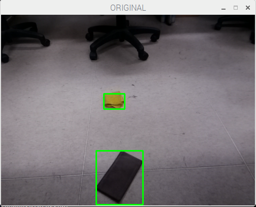
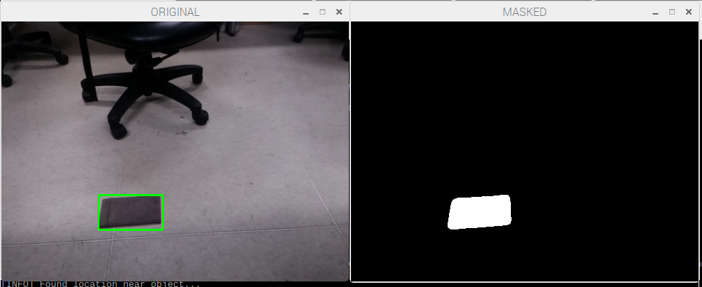

# 2017Fall-SmartGarbageCar

## Motivation
We got inspiration of this project from the video of an autonomous trash can on wheels that can position itself underneath pieces of garbage one tosses in its general vicinity. This original work is based on wireless communication with MicroSoft's motion sensing camera and a powerful program that can predict where the garbage will land. In consideration of our limited devices, we proposed this project to design a smart garbage car that can detect and clean up garbages in a small area. And we implemented it on Raspberry Pi and Arduino with technique of BLE and openCV.

## Implement
The implement of this project is composed of three parts: 
- the detection of garbage and car on Raspberry Pi
- the movement of car
- the communication between car and Raspberry Pi
### Movement
The car is driven by two parallax continuous rotation servos, which are controlled by an Arduino Uno. The servo can be controlled by writing its duty cycle using Arduino `<servo.h>` libriray. Before mounted to the car, the servos should be calibrated by adjusting the  potentiometer in the servo using a screwdriver, while the "stay-still" signal is sending to the servo. After doing that, the servo will rotate forward if its duty cycle is set above the stay-still signal, while it will rotate reversely if the duty cycle is lower than that. 
#### Movement Command
The car can take five command: forward, backward, turn left, turn right and pick the garbage, and we control the moving distance of the car by setting the time interval between the rotation signal and stay-still signal. 

When designing the scheme of controlling the car's movement, we considered 2 different plans. The first one is sending it the angle and distance between the itself and the garbage, but we found it quite difficult to control the car to turn a degree precisely, because the surface of both the wheels and the ground are very smooth and the fictional force is not enough. And sometimes they get stuck when a rotation signal is received. So we decided not to change its direction by the degree of angles and switch to the second plan. In the plan B, we control the car to move only horizontoally or vertically regarding to its former direction. And the only rotation angle is 90 degree, which is much easier to tune in the Arduino code. 

### Detection

#### path
One big problem of moving the car to pick up the garbage is to find an appropriate path. Since we do not have an extra camera on the car, it is impossible for the car to know where to go and we have to calculate the path for the car so that it can get to the right position. However, the direction of car can not be directly detected by the camera and it is changing all the time. Therefore, we record the original direction of the car at the inital stage, and recalculate it when the car moves.

### Communication
The Raspberry Pi and Arduino communicate with each other over BLE connection. In this project, the Arduino works as a BLE peripheral and provide GATT service, while the Raspberry Pi works as a central and a client. The transmission of information is implemented writing value to a GATT characteristic.
#### BLE module
We use an HM10 module to make the arduino work as a BLE peripheral. HM10 has 6 pins and we only need 4 of them in this case. The RX and TX pin are connected to Arduino digital pins. The VCC and GND pin are also connected to 5V and GND on the Arduino respectively. 

![alt text][img]

[img]:http://fab.cba.mit.edu/classes/863.15/doc/tutorials/programming/bluetooth/bluetooth2.jpg "HM10 module"

The HM10 module can be configured using its provided set of AT commands. There are some useful AT commands that we used when setting up BLE connection.

- AT+ADDR?: get the address of HM10 module
- AT+BAUD9600: set the baud rate to 9600 (BLE default)
- AT+ROLE0: set its role as BLE peripheral
- AT+UUID?: get the uuid of its provided service
- AT+FFE2: add a second characteristic to its service. 

By default, there is a single custom characteristic under a custom service provided by the HM10 module, and we can add a second write only characteristic using the AT command mentioned above. After configuration, the Arduino can get commands from Raspberry Pi by reading the value of that characteristic.

#### GATT programming
The program of implementing the RPi as a BLE center is based on `pygatt` library, which provides a Pythonic API by wrapping up gatttool command line utility. 

To connect the raspberry pi with HM10 module, 
